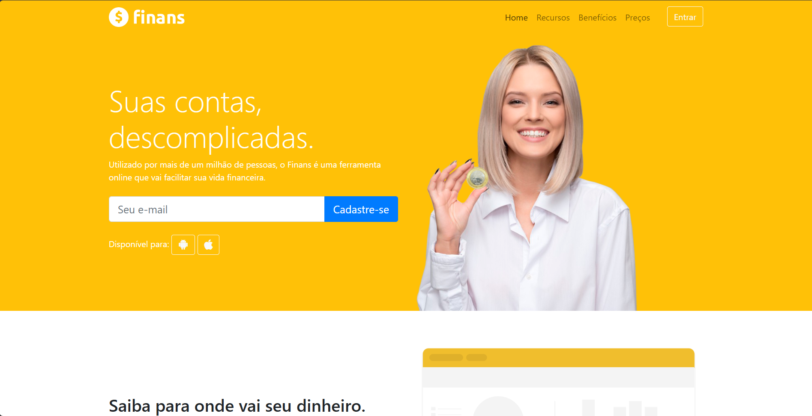

# Finans - Landing Page 💰
O seu aplicativo de finanças pessoais!

---

### Captura de Tela 📷

---

### Sobre o Projeto 📝
>A `Finans` é uma landing page desenvolvida para promover um aplicativo de finanças pessoais que ajuda os usuários a controlar seus gastos, criar orçamentos e alcançar suas metas financeiras de forma inteligente.
>Esta landing page foi construída com o framework `Bootstrap`, garantindo um design moderno, responsivo e intuitivo, com o objetivo de atrair potenciais usuários e fornecer informações claras sobre as funcionalidades e benefícios do aplicativo.

### Funcionalidades 📌
- **Layout responsivo**: Adaptável a diferentes dispositivos (desktop, tablets e smartphones).
- **Seções informativas**: Inclui seções sobre funcionalidades do aplicativo, depoimentos de usuários e call-to-action.
- **Botões de download**: Links para download do app nas lojas (Google Play e App Store).
- **Formulário de contato**: Para os usuários que desejam se inscrever ou saber mais informações.
- **Design moderno e limpo**: Interface amigável com tipografia e cores pensadas para conversão.

---

### Tecnologias Utilizadas
>  

---

💡 **Dúvidas ou sugestões?** Entre em contato ou contribua para o projeto!
